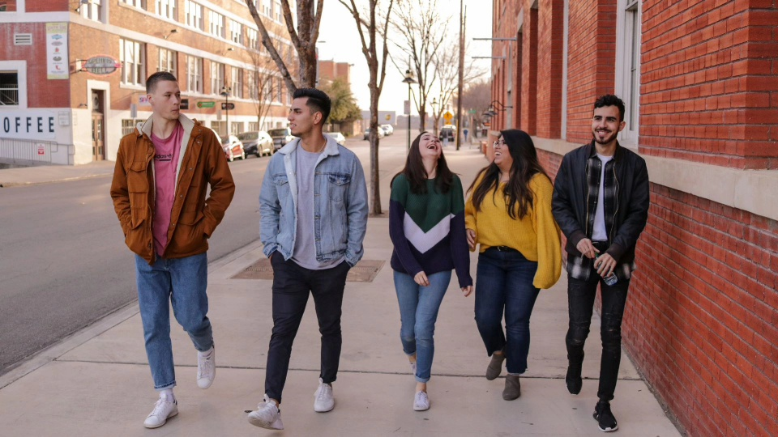
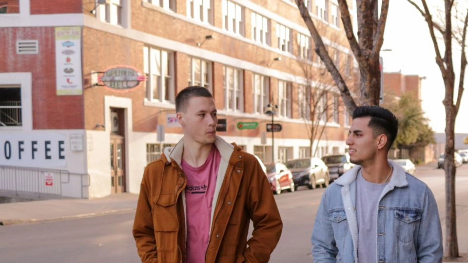
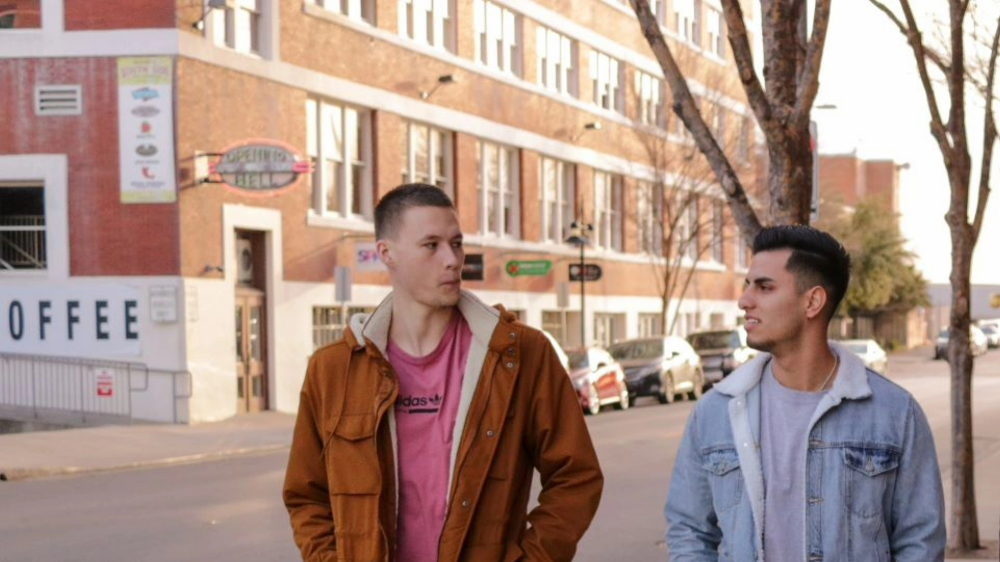
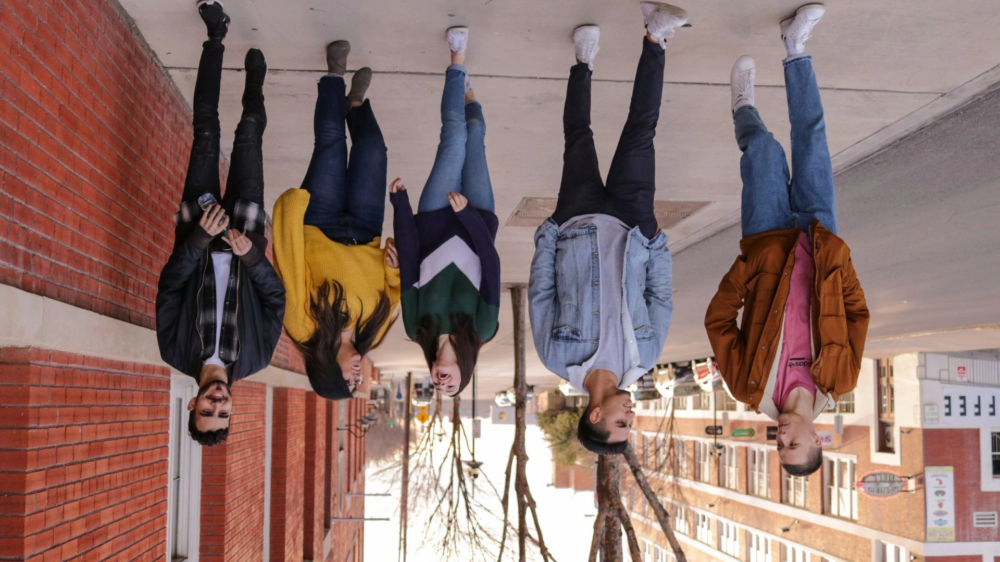
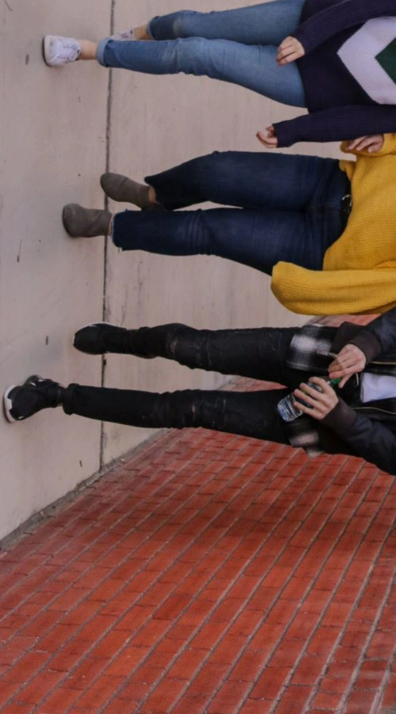
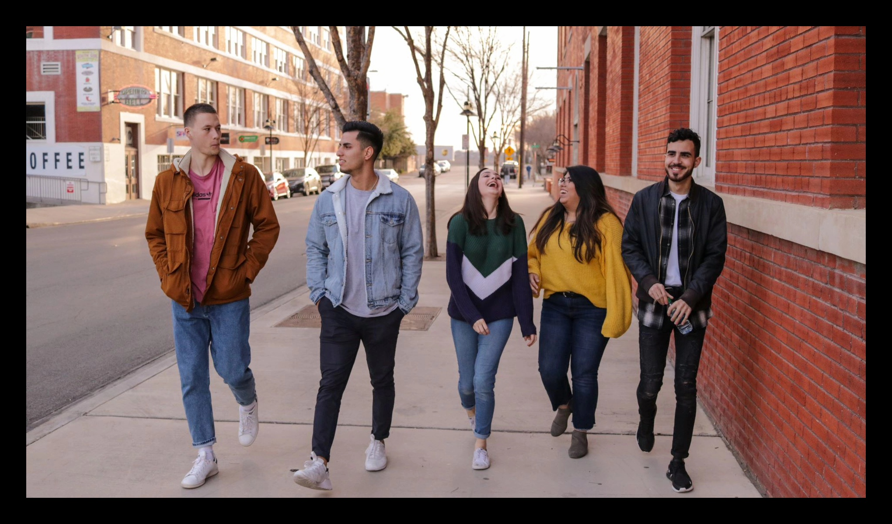
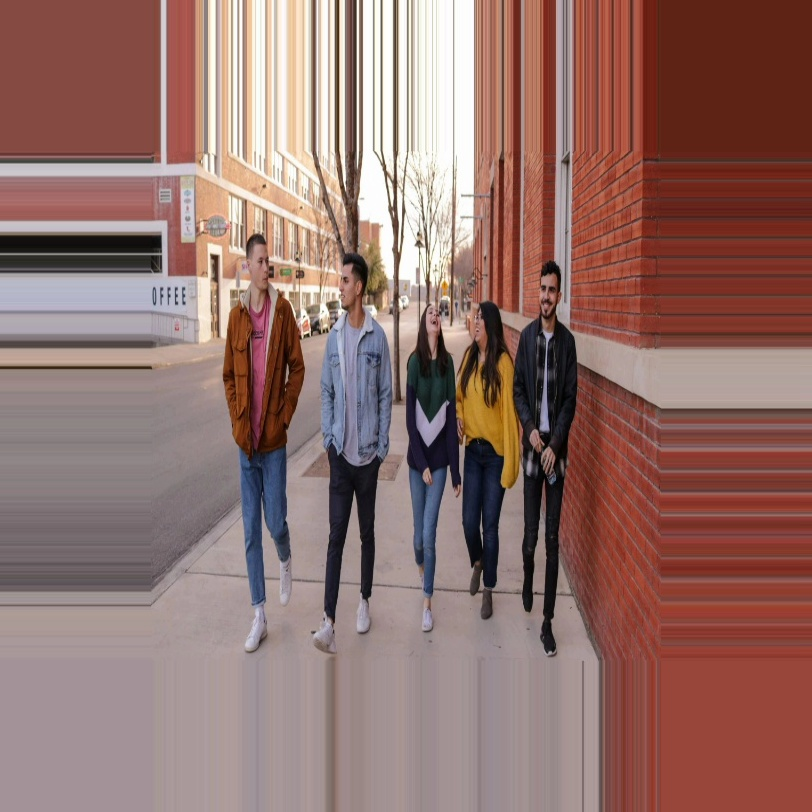
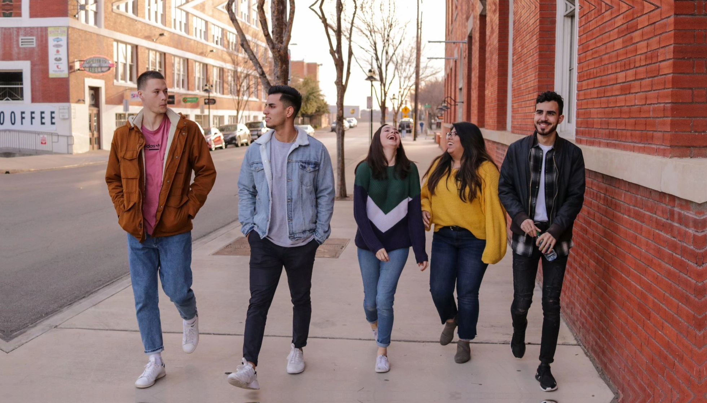

Getting Started with hobot_cv
=======

# 功能介绍

hobot_cv package是地平线机器人开发平台的一部分，为应用开发提供了bpu和vps的图片处理加速接口。目前实现了图片的crop, resize, rotate，边界填充以及金字塔缩放功能，只支持nv12格式。

hobot_cv高斯滤波和均值滤波接口，支持bpu和neon加速。

# 编译

## 依赖库

- dnn:1.8.4
- opencv:3.4.5

## 开发环境

- 编程语言: C/C++
- 开发平台: X3/X86
- 系统版本：Ubuntu 20.0.4
- 编译工具链:Linux GCC 9.3.0/Linaro GCC 9.3.0

## 编译

支持在X3 Ubuntu系统上编译和在PC上使用docker交叉编译两种方式。

### X3 Ubuntu系统上编译

1、编译环境确认

- 板端已安装X3 Ubuntu系统。
- 当前编译终端已设置TogetherROS环境变量：`source PATH/setup.bash`。其中PATH为TogetherROS的安装路径。
- 已安装ROS2编译工具colcon。安装的ROS不包含编译工具colcon，需要手动安装colcon。colcon安装命令：`pip install -U colcon-common-extensions`

2、编译

- 编译命令：`colcon build --packages-select hobot_cv`

### docker交叉编译

1、编译环境确认

- 在docker中编译，并且docker中已经安装好TogetherROS。docker安装、交叉编译说明、TogetherROS编译和部署说明详见机器人开发平台robot_dev_config repo中的README.md。

2、编译

- 编译命令：

  ```
  export TARGET_ARCH=aarch64
  export TARGET_TRIPLE=aarch64-linux-gnu
  export CROSS_COMPILE=/usr/bin/$TARGET_TRIPLE-

  colcon build --packages-select hobot_cv \
     --merge-install \
     --cmake-force-configure \
     --cmake-args \
     --no-warn-unused-cli \
     -DCMAKE_TOOLCHAIN_FILE=`pwd`/robot_dev_config/aarch64_toolchainfile.cmake
  ```

## 注意事项
  目前hobot_cv crop&resize&rotate只支持nv12格式。

  vps加速，对不同输入输出属性第一次处理会进行硬件属性的配置，耗时较长。如果配置属性不变，硬件直接处理，则耗时较低。如果配置完group属性后，超过10s没有输入对应此group的输入图片，hobot_cv会判定此输入group失活，group资源会被重新利用。group资源会与创建该group的进程绑定使用，并只在此进程内使用，进程结束，group自动释放。hobot_cv默认使用group4，group5，group6和group7这四个group，所以hobot_cv最多支持四个不同输入属性同时使用vps加速。

  VPS加速，输入输出图片最大4096*2160，最小32*32。最大支持1.5倍放大，1/8缩小。宽度需为16的倍数，高度需为偶数。

  BPU加速，缩放范围是dst/src取值[1/185,256), 输入宽度为[16,4080], 宽度需为2的倍数。输出尺寸要求w<=4080,h<=4080。
  crop功能，crop区域必须在原图像内部。

# 使用介绍

## package说明
  源码包含**hobot_cv package**，用户可通过hobot_cv提供的接口实现图片的crop，resize，rotate, 高斯滤波。

  hobotcv提供的图片处理加速方式有bpu和vps加速。crop,resize可以选择使用bpu或vps加速，rotate和pyramid只能使用vps。

  如果用户需要低频处理图片则可以选择使用bpu加速，bpu加速不需要对硬件进行单独的属性配置，vps对硬件属性进行配置耗时较长。

  如果是摄像头采集图片做crop&resize处理后用于模型推理则可以选择使用vps加速，这种情况下输入输出的配置相对稳定不会有大的变动，而且摄像头正常采集图片的频率也不会触发超时判断。

## 接口说明

### resize

int hobotcv_resize(const cv::Mat &src,int src_h,int src_w,cv::Mat &dst,int dst_h,int dst_w,HobotcvSpeedUpType type = HOBOTCV_AUTO);

功能介绍：nv12格式图片的resize功能。

返回值：成功返回0，失败返回非零。

参数：

| 参数名 | 解释                 |
| ------ | -------------------- |
| src    | 原nv12格式的图像矩阵 |
| src_h    | 原图高               |
| sc_w     | 原图宽               |
| dst    | resize后的图像矩阵   |
| dst_h  | resize后的高         |
| dst_w  | resize后的宽         |
| type | 接口加速类型枚举，默认HOBOTCV_AUTO不符合vps加速的输入输出采用bpu加速。HOBOTCV_VPS为vps加速，HOBOTCV_BPU为bpu加速|

std::shared_ptr<ImageInfo> hobotcv_resize(const char *src,int src_h,int src_w,int dst_h,int dst_w,HobotcvSpeedUpType type = HOBOTCV_AUTO);

功能介绍：nv12格式图片的resize功能。输入输出图片数据为nv12数据的地址。

返回值：成功返回resize后的图片数据地址，失败返回nullptr

参数：

| 参数名 | 解释                  |
| ------ | -------------------- |
| src    | 输入图片数据地址       |
| src_h  | 输入图片高            |
| sc_w   | 输入图片宽            |
| dst_h  | resize后的高         |
| dst_w  | resize后的宽         |
| type | 接口加速类型枚举，默认HOBOTCV_AUTO不符合vps加速的输入输出采用bpu加速。HOBOTCV_VPS为vps加速，HOBOTCV_BPU为bpu加速|

### crop&resize

cv::Mat hobotcv_crop(cv::Mat &src,int src_h,int src_w,int dst_h,int dst_w,const cv::Range& rowRange,const cv::Range& colRange,HobotcvSpeedUpType type = HOBOTCV_AUTO);

功能介绍：将crop区域resize到目标大小。如果crop区域与resize后的大小一致，则只会crop。

返回值：crop&resize之后的nv12图像矩阵。

注意：crop区域要在图片范围内

参数：
| 参数名   | 解释                 |
| -------- | --------------------|
| src      | 原nv12格式的图像矩阵 |
| src_h    | 原图高               |
| sc_w     | 原图宽               |
| dst_h    | resize后的高         |
| dst_w    | resize后的宽         |
| rowRange | crop的纵向坐标范围   |
| colRange | crop的横向坐标范围   |
| type | 接口加速类型枚举，默认HOBOTCV_AUTO不符合vps加速的输入输出采用bpu加速。HOBOTCV_VPS为vps加速，HOBOTCV_BPU为bpu加速|

std::shared_ptr<ImageInfo> hobotcv_crop(const char *src,int src_h,int src_w,int dst_h,int dst_w,const cv::Range &rowRange,const cv::Range &colRange,HobotcvSpeedUpType type = HOBOTCV_AUTO);

功能介绍：将crop区域resize到目标大小。如果crop区域与resize后的大小一致，则只会crop。输入输出图片数据为nv12数据的地址。

返回值：成功返回crop&resize后的图片数据地址，失败返回nullptr

注意：crop区域要在图片范围内

参数：
| 参数名   | 解释                 |
| -------- | --------------------|
| src      | 输入图片数据地址      |
| src_h    | 输入图片高           |
| sc_w     | 输入图片宽           |
| dst_h    | resize后的高         |
| dst_w    | resize后的宽         |
| rowRange | crop的纵向坐标范围   |
| colRange | crop的横向坐标范围   |
| type | 接口加速类型枚举，默认HOBOTCV_AUTO不符合vps加速的输入输出采用bpu加速。HOBOTCV_VPS为vps加速，HOBOTCV_BPU为bpu加速|

### rotate

int hobotcv_rotate(const cv::Mat &src, cv::Mat &dst, ROTATION_E rotate);

功能介绍：将传入的图片进行旋转，只支持90，180，270度的旋转。采用vps加速。

返回值：成功返回0，失败返回非零。

参数：
| 参数名   | 解释                 |
| -------- | -------------------- |
| src      | 原nv12格式的图像矩阵 |
| dst      | 旋转后的图像矩阵   |
| rotate   | 旋转角度的枚举  |

std::shared_ptr<ImageInfo> hobotcv_rotate(const char *src,int src_h,int src_w,ROTATION_E rotate);

功能介绍：将传入的图片进行旋转，只支持90，180，270度的旋转。采用vps加速。输入输出图片数据为nv12数据的地址。

返回值：成功返回旋转后的图片数据地址，失败返回nullptr

参数：
| 参数名   | 解释                 |
| -------- | --------------------|
| src      | 输入图片数据地址      |
| src_h    | 输入图片高           |
| src_w     | 输入图片宽           |
| rotate   | 旋转角度             |

### crop&resize&rotate

int hobotcv_imgproc(const cv::Mat &src,cv::Mat &dst,int dst_h,int dst_w,ROTATION_E rotate,const cv::Range &rowRange,const cv::Range &colRange);

功能介绍：crop，resize，rotate的全功能接口。先在原图中裁剪指定区域，然后缩放，最后旋转。采用vps加速。

返回值：成功返回0，失败返回非零。

注意：dst_h，dst_w是resize后的大小。无需考虑旋转后的宽高，接口会自动处理。例如，resize后的宽高为1920*1080，dst_w，dst_h传参分别为1920，1080。

参数：
| 参数名   | 解释                 |
| -------- | -------------------- |
| src      | 原nv12格式的图像矩阵 |
| dst      | 用于接收处理后的图像矩阵 |
| dst_h     | resize后的高         |
| dst_w     | resize后的宽         |
| rotate   | 旋转角度的枚举，为0时关闭rotate  |
| rowRange | crop的纵向坐标范围，范围为0时关闭crop|
| colRange | crop的横向坐标范围，范围为0时关闭crop|

std::shared_ptr<ImageInfo> hobotcv_imgproc(const char *src,int src_h,int src_w,int dst_h,int dst_w,ROTATION_E rotate,const cv::Range &rowRange,const cv::Range &colRange);

功能介绍：crop，resize，rotate的全功能接口。先在原图中裁剪指定区域，然后缩放，最后旋转。采用vps加速。输入输出图片数据为nv12数据的地址。

返回值：成功返回处理后的图片数据指针，失败返回nullptr

注意：dst_h，dst_w是resize后的大小。无需考虑旋转后的宽高，接口会自动处理。例如，resize后的宽高为1920*1080，dst_w，dst_h传参分别为1920，1080。

参数：
| 参数名   | 解释                 |
| -------- | -------------------- |
| src      | 输入图片数据地址      |
| src_h    | 输入图片高            |
| src_w     | 输入图片宽           |
| dst_h     | resize后的高         |
| dst_w     | resize后的宽         |
| rotate   | 旋转角度的枚举，为0时关闭rotate  |
| rowRange | crop的纵向坐标范围，范围为0时关闭crop|
| colRange | crop的横向坐标范围，范围为0时关闭crop|

### pyramid

int hobotcv_pymscale(const cv::Mat &src, OutputPyramid *output, const PyramidAttr &attr);

功能介绍：金字塔缩放的功能接口。通过参数attr配置缩小以及roi区域。缩小图像层数24(0~23)层，其中 0、4、8、12、16、20层为基础Base层，基于原图片进行缩放，基础层的每一层size都是上一基础层的1/2。其余层为ROI层，ROI层基于Base层作缩小(1、2、3 层基于Base0层，5、6、7 层基于Base4层，以此类推)各层可以单独使能，缩放区域、缩放系数可配置。

返回值：成功返回0，失败返回非零。

注意：最大输入图像4096x4096，最小输入图像64x64。最大输出图像2048x2048,最小输出图像48x32。基于vps硬件要求，必须使能Base0和Base4层。

roi层输出计算公式：targetW = (roi_width - 1) x 64 / (64 + 1) + 1; targetH = (((roi_height / 2 - 1) x 64 / (64 + 1)) + 1) x 2; tag宽高向下取偶，如得到一个401 x 401的size，会向下取偶得到400 x 400

参数：
| 参数名   | 解释                 |
| -------- | --------------------|
| src      | 原nv12格式的图像矩阵 |
| output | 金字塔缩放后的图像输出指针，内存由接口调用方提供 |
| attr | 金字塔缩放层的属性配置参数 |

PyramidAttr：金字塔缩放配置
| 参数名        | 解释                            |
| -------------| -----------------------------------|
| timeout      | 获取结果超时时间，单位ms             |
| ds_info      | pyramid缩小层的配置信息，基础层加roi层共24层 |

ds_info中的factor取值范围为0~63。对于基础层，factor为0时表示disable该层，非0时表示使能该层。对于roi层，factor为0时表示disable该层，非0时为该roi层的计算因子，该层的输出size可通过roi层输出计算公式获取。

OutputPyramid：金字塔缩放图片输出数据结构
| 参数名        | 解释                            |
| -------------| -----------------------------------|
| isSuccess    | 接口处理图片是否成功，0：失败 1：成功 |
| pym_out      | pyramid缩放输出图片信息的数组，每一层是否有输出取决于PyramidAttr中对该层的factor配置是否为0 |

int hobotcv_pymscale(const char *src,int src_h,int src_w,OutputPyramid *output,const PyramidAttr &attr);

功能介绍：金字塔缩放的功能接口。具体功能与上一个接口"int hobotcv_pymscale(const cv::Mat &src, OutputPyramid *output, const PyramidAttr &attr)"相同，区别在输入图片为nv12格式图片的数据地址。

返回值：成功返回0，失败返回非零。

参数：
| 参数名   | 解释                 |
| -------- | --------------------|
| src      | 输入图片数据地址 |
| src_h    | 输入图片高            |
| src_w     | 输入图片宽           |
| output | 金字塔缩放后的图像输出指针，内存由接口调用方提供 |
| attr | 金字塔缩放层的属性配置参数 |

### 边界填充

HobotcvImagePtr hobotcv_BorderPadding(const char *src, const int &src_h, const int &src_w, const HobotcvPaddingType type, const PaddingArea &area, const uint8_t value = 0);

功能介绍：对传入的原图片进行padding操作，支持指定填充区域和填充值。支持HOBOTCV_CONSTANT、HOBOTCV_REPLICATE和HOBOTCV_REFLECT三种填充方式。
          当type为HOBOTCV_CONSTANT时接口传入的value有效，用value 的数值进行填充。
          当type为HOBOTCV_REPLICATE时，使用原图中最边界的像素值进行填充(例如：例如：aaaaaa|abcdefgh|hhhhhhh)。
          当type为HOBOTCV_REFLECT时，以原图边界为轴的镜像填充(例如：fedcba|abcdefgh|hgfedcb)
          padding后的图片高h = src_h + area.top + area.bottom, 图片宽w = src_w + area.left + area.right
          padding成功后，通过返回值返回padding后的图片数据指针。

返回值：成功返回输出图片数据指针，失败返回nullptr

参数：
| 参数名   | 解释                 |
| -------- | --------------------|
| src      | 原nv12格式的图像数据 |
| src_h    | 原图高              |
| src_w    | 原图宽              |
| type     | 填充方式            |
| area     | 填充区域，支持指定上下左右区域 |
| value    | 填充的像素值，取值0~255，默认为0 |

### 高斯滤波(BPU加速)

int HobotCVGaussianBlurCreate(HobotGaussianBlurParam param, HobotCVGaussianBlurHandle *phandle);

功能介绍：创建高斯滤波的句柄。

返回值：0表示成功，<0表示失败。

参数：

| 参数名   | 解释               |
| -------- | ------------------ |
| param：  | 高斯滤波           |
| --type   | 滤波类型           |
| --width  | 滤波的宽           |
| --height | 滤波的高           |
| --ksizeX | 滤波核的宽         |
| --ksizeY | 滤波核的高         |
| --sigmaX | sigma的宽          |
| --sigmaY | sigma的高          |
| phandle  | 创建成功返回的句柄 |

注：当前版本支持的参数范围如下：

- 滤波类型：高斯滤波
- 支持的数据类型：int16
- 支持的分辨率：320x240。
- 滤波核：高斯3x3
- sigmax: 0.
- sigmay: 0.

int HobotCVGaussianBlurProcess( HobotCVGaussianBlurHandle *phandle，cv::Mat *src，cv::Mat *dst);

功能介绍：创建高斯滤波的句柄。

返回值：0表示成功，<0表示失败。

参数：

| 参数名  | 解释                |
| ------- | ------------------- |
| phandle | 创建成功返回的句柄  |
| src     | 原始的TOF数据矩阵   |
| dst     | 滤波后的TOF数据矩阵 |

int HobotCVGaussianBlurDestroy( HobotCVGaussianBlurHandle *phandle);

功能介绍：创建高斯滤波的句柄。

返回值：0表示成功，<0表示失败。

参数：

| 参数名  | 解释                         |
| ------- | ---------------------------- |
| phandle | 创建成功返回的句柄，用于释放 |

### 高斯滤波(neon加速)

int HobotGaussianBlur(const cv::Mat &src, cv::Mat &dst, cv::Size ksize);

功能介绍：高斯滤波neon加速处理。

返回值：0表示成功，-2表示非x3平台运行，-1表示参数错误。

参数：
| 参数名  | 解释                         |
| ------- | ---------------------------- |
| src | 输入的原始数据矩阵，目前只支持CV_16SC1和CV_16UC1数据类型 |
| dst | 高斯滤波处理后输出数据矩阵 |
| ksize | 高斯滤波器模板大小，目前只支持3x3和5x5大小 |

### 均值滤波

int HobotMeanBlur(const cv::Mat &src, cv::Mat &dst, cv::Size ksize);

功能介绍：均值滤波neon加速处理。

返回值：0表示成功，-2表示非x3平台运行，-1表示参数错误。

参数：
| 参数名  | 解释                         |
| ------- | ---------------------------- |
| src | 输入的原始数据矩阵，目前只支持CV_16SC1和CV_16UC1数据类型 |
| dst | 均值滤波处理后输出数据矩阵 |
| ksize | 均值滤波器模板大小，目前只支持3x3和5x5大小 |

## 运行
- 编译成功后，将生成的install路径拷贝到地平线X3开发板上（如果是在X3上编译，忽略拷贝步骤），并执行如下命令运行。

## X3 Ubuntu系统上运行

```
export COLCON_CURRENT_PREFIX=./install
source ./install/local_setup.bash
# config中为example使用的模型，回灌使用的本地图片
# 根据实际安装路径进行拷贝（X3 Ubuntu中编译拷贝命令为cp -r install/hobot_cv/lib/hobot_cv/config/ .）。
cp -r install/lib/hobot_cv/config/ .

# 启动crop&resize&rotate&pyramid launch文件
ros2 launch hobot_cv hobot_cv_crop_resize_rotate_pyramid.launch.py

# 启动test_gaussian_blur launch文件
使用本地tof格式图片通过hobot_cv接口实现图片的高斯滤波。
ros2 launch hobot_cv hobot_cv_gaussian_blur.launch.py

# 启动neon_example launch文件
使用本地tof格式图片通过hobot_cv接口时实现图片的高斯滤波与均值滤波，采用neon加速
ros2 launch hobot_cv hobot_cv_neon_blur.launch.py

```

## X3 yocto系统上运行

```
export ROS_LOG_DIR=/userdata/
export LD_LIBRARY_PATH=${LD_LIBRARY_PATH}:./install/lib/

# config中为example使用的模型，回灌使用的本地图片
cp -r install/lib/hobot_cv/config/ .

# 使用本地JPEG格式图片通过hobot_cv接口实现图片的crop，resize，rotate并以JPEG格式存储变换后的图片
./install/lib/hobot_cv/example

# 运行模式2：
使用本地tof格式图片通过hobot_cv接口实现图片的高斯滤波，采用bou加速。
ros2 run hobot_cv test_gaussian_blur

# 运行模式3：
使用本地tof格式图片通过hobot_cv接口实现图片的高斯滤波与均值滤波，采用neon加速。
ros2 run hobot_cv neon_example

```

# 结果分析

## X3结果展示

### crop&resize&rotate&pyramid

```
[INFO] [launch]: Default logging verbosity is set to INFO
[INFO] [example-1]: process started with pid [2840]
[example-1] [INFO] [1655951548.571526792] [example]:
[example-1] source image config/test.jpg is 1920x1080 pixels
[example-1] [INFO] [1655951548.571669584] [example]: resize image to 960x540 pixels, time cost: 280 ms
[example-1] [INFO] [1655951548.642678167] [example]: resize image to 960x540 pixels, time cost: 14 ms
[example-1] [INFO] [1655951548.645212667] [example]: crop image to 960x540 pixels, time cost: 2 ms
[example-1] [INFO] [1655951548.694760625] [example]: crop image to 960x540 pixels, time cost: 1 ms
[example-1] [BPU_PLAT]BPU Platform Version(1.3.1)!
[example-1] [HBRT] set log level as 0. version = 3.13.27
[example-1] [DNN] Runtime version = 1.8.4_(3.13.27 HBRT)
[example-1] [INFO] [1655951548.734399167] [example]: crop image to 960x540 pixels and resize image to 1920x1080 pixels, time cost: 39 ms
[example-1]
[example-1] [INFO] [1655951548.943125584] [example]: crop image to 960x540 pixels and resize image to 1920x1080 pixels, time cost: 15 ms
[example-1]
[example-1] [INFO] [1655951549.077968876] [example]: rotate image 180 , time cost: 134 ms
[example-1]
[example-1] [INFO] [1655951549.315988376] [example]: second rotate image 180 , time cost: 38 ms
[example-1]
[example-1] [INFO] [1655951549.638380626] [example]: crop image to 960x540 pixels  and resize image to 1440x800 pixels and rotate 90, time cost: 322 ms
[example-1]
[example-1] [INFO] [1655951549.764873834] [example]: crop image to 960x540 pixels  and resize image to 1440x800 pixels and rotate 90, time cost: 20 ms
[example-1]
[example-1] [INFO] [1655951550.045702293] [example]: pyramid image , time cost: 280 ms
[example-1]
[example-1] [INFO] [1655951550.327614543] [example]: pyramid image , time cost: 19 ms
[example-1]
[INFO] [example-1]: process has finished cleanly [pid 2840]
```

根据log显示，测试程序完成了对本地1920x1080分辨率图片resize，crop，crop&resize，rotate，crop&resize&rotate，pyramid的处理,同一接口分别调用了两次。两次耗时对比如下

| 图片处理                               | 第一次运行耗时 | 第二次运行耗时 |
| ------------------------------------- | ------------- | ------------- |
| 1920x1080 resize到960x540              | 280ms        | 14ms          |
| 1920x1080 crop出960x540                | 2ms          | 1ms           |
| crop出960x540 resize到1920x1080        | 39ms         | 15ms          |
| 1920x1080旋转180度                     | 134ms        | 38ms          |
| crop出960x540 resize到1440x800 旋转90度 | 322m        | 20ms          |
| pyramid基础层缩小图片                   | 280m        | 19ms          |

因为第一次运行，需要对vps硬件进行配置所以耗时较多，如果不再更改硬件配置属性，则硬件直接进行处理，耗时就会显著降低。

原图展示：


resize效果展示：



crop效果展示：



crop&resize效果展示：



rotate效果展示：



crop&resize&rotate效果展示:



pyramid缩小效果展示,每层为上一层的1/2：


### resize
启动命令：ros2 launch hobot_cv hobot_cv_resize.launch.py
输出结果：
```
[INFO] [launch]: Default logging verbosity is set to INFO
[INFO] [resize_example-1]: process started with pid [120089]
[resize_example-1] [INFO] [1666364548.561811871] [example]:
[resize_example-1] source image config/test.jpg is 1920x1080 pixels
[resize_example-1] [INFO] [1666364548.561984163] [example]: resize image to 960x540 pixels, time cost: 51 ms
[resize_example-1] [INFO] [1666364548.634829288] [example]: resize image to 960x540 pixels, time cost: 12 ms
[resize_example-1] [INFO] [1666364548.647819913] [example]: nv12 interface resize image to 960x540 pixels, time cost: 12 ms
[INFO] [resize_example-1]: process has finished cleanly [pid 120089]
```

根据log显示，example对1920x1080分辨率图片进行了三次resize操作，前两次使用输入输出图片为cv::Mat的接口，第三次使用输入输出图片为nv12数据指针的接口，三次resize耗时统计如下：

| 图片处理                               | 第一次运行耗时 | 第二次运行耗时 | 第三次运行耗时 |
| ------------------------------------- | ------------- | ------------- |------------- |
| 1920x1080 resize到960x540              | 51ms         | 12ms          | 12ms          |

因为第一次运行，需要对硬件进行配置所以耗时较多，如果不再更改硬件配置属性，则硬件直接进行处理，耗时就会显著降低。resize的两种接口，耗时无明显变化。

### crop
启动命令：ros2 launch hobot_cv hobot_cv_crop.launch.py
输出结果：
```
[INFO] [launch]: Default logging verbosity is set to INFO
[INFO] [crop_example-1]: process started with pid [117973]
[crop_example-1] [INFO] [1666364496.940625763] [example]: crop image to 960x540 pixels, time cost: 2 ms
[crop_example-1] [INFO] [1666364497.028130347] [example]: crop image to 960x540 pixels, time cost: 2 ms
[crop_example-1] [INFO] [1666364497.032258180] [example]: nv12 interface crop image to 960x540 pixels, time cost: 3 ms
[INFO] [crop_example-1]: process has finished cleanly [pid 117973]
```

根据log显示，example对1920x1080分辨率图片进行了三次crop出960x540的操作，前两次使用输入输出图片为cv::Mat的接口，第三次使用输入输出图片为nv12数据指针的接口，三次resize耗时统计如下：
| 图片处理                               | 第一次运行耗时 | 第二次运行耗时 | 第三次运行耗时 |
| ------------------------------------- | ------------- | ------------- |------------- |
| 1920x1080 crop出960x540              | 2ms         | 2ms          | 3ms          |

因为crop操作时直接在原图中裁剪，未经过硬件加速，所以每次接口调用耗时无明显差别。第三次使用输入输出图片为nv12数据指针的接口，在接口中涉及到内存的申请过程，所以耗时可能会由略为增加。

### rotate
启动命令：ros2 launch hobot_cv hobot_cv_rotate.launch.py
输出结果：
```
[INFO] [launch]: Default logging verbosity is set to INFO
[INFO] [rotate_example-1]: process started with pid [121764]
[rotate_example-1] [INFO] [1666364588.685647265] [example]: rotate image 180 , time cost: 163 ms
[rotate_example-1]
[rotate_example-1] [INFO] [1666364588.937273432] [example]: second rotate image 180 , time cost: 38 ms
[rotate_example-1]
[rotate_example-1] [INFO] [1666364588.975745807] [example]: nv12 interface rotate image 180 , time cost: 38 ms
[rotate_example-1]
[INFO] [rotate_example-1]: process has finished cleanly [pid 121764]
```
根据log显示，example对1920x1080分辨率图片进行了三次旋转180度的操作，前两次使用输入输出图片为cv::Mat的接口，第三次使用输入输出图片为nv12数据指针的接口，三次resize耗时统计如下：
| 图片处理             | 第一次运行耗时 | 第二次运行耗时 | 第三次运行耗时 |
| --------------------| ------------- | ------------- |------------- |
| 1920x1080 旋转180度  | 163ms           | 38ms          | 38ms          |

### padding
example启动命令：ros2 launch hobot_cv hobot_cv_padding.launch.py
输出结果：
```
[INFO] [launch]: Default logging verbosity is set to INFO
[INFO] [padding_example-1]: process started with pid [219943]
[padding_example-1] [INFO] [1666363731.418628584] [example]: 480 x 270 hobot_cv constant padding  top:100 bottom: 100 left: 100 right: 100, time cost: 1 ms
[padding_example-1]
[padding_example-1] [INFO] [1666363731.458502459] [example]: 480 x 270 hobot_cv replicate padding top:100 bottom: 100 left: 100 right: 100, time cost: 1 ms
[padding_example-1]
[padding_example-1] [INFO] [1666363731.493979875] [example]: 480 x 270 hobot_cv reflect padding top:100 bottom: 100 left: 100 right: 100, time cost: 3 ms
[padding_example-1]
[padding_example-1] [INFO] [1666363731.531334959] [example]: 480 x 270 opencv constant padding top:100 bottom: 100 left: 100 right: 100, time cost: 2 ms
[padding_example-1]
[padding_example-1] [INFO] [1666363731.562557334] [example]: 480 x 270 opencv replicate padding top:100 bottom: 100 left: 100 right: 100, time cost: 1 ms
[padding_example-1]
[padding_example-1] [INFO] [1666363731.594738500] [example]: 480 x 270 opencv reflect padding top:100 bottom: 100 left: 100 right: 100, time cost: 1 ms
[padding_example-1]
[INFO] [padding_example-1]: process has finished cleanly [pid 219943]
```

根据log显示，测试程序完成了对本地480x270分辨率图片的上下左右区域各填充100长度，
hobot_cv三种填充方式与分别对应的opencv填充耗时对比如下
|    填充方式     | hobot_cv耗时 | opencv耗时 |
|  ------------- | ------------ | ---------- |
|   CONSTANT     |    1ms       |    2ms     |
|   REPLICATE    |    1ms       |    1ms     |
|   REFLECT      |    3ms       |    1ms     |

原图展示：


HOBOTCV_CONSTANT方式填充展示：


HOBOTCV_REPLICATE方式填充展示：


HOBOTCV_REFLECT方式填充展示：


### 高斯滤波bpu加速

```
输出结果：

===================
image name :images/frame1_4.png
infe cost time:1314
guss_time cost time:2685
hobotcv save rate:0.510615

analyse_result start 
---------GaussianBlur
out_filter type:2,cols:320,rows:240,channel:1
cls_filter type:2,cols:320,rows:240,channel:1
out_filter minvalue:96,max:2363
out_filter min,x:319,y:115
out_filter max,x:147,y:239
cls_filter minvalue:96,max:2364
cls_filter min,x:319,y:115
cls_filter max,x:147,y:239

diff diff diff
mat_diff minvalue:0,max:2
mat_diff min,x:2,y:0
mat_diff max,x:110,y:14

error sum:8.46524e+06,max:2,mean_error:0.439232
analyse_result,time_used_ms_end:2
analyse_result end 

------------------------- 
```

其中：

infe cost time:1314　//表示hobotcv加速的高斯滤波耗时1314微秒．

guss_time cost time:2685　//表示opencv的高斯滤波耗时2685微秒．

hobotcv save rate = （guss_time cost time - infe cost time）/ guss_time cost time = 0.510615

从以上比较结果，经过hobotcv加速后性能提升50%。

error sum:8.46524e+06,max:2,mean_error:0.439232　//单张图片总误差是：8.46524e+06，单个像素最大误差是：２，平均误差：0.439232

平均误差　＝　sum / (width * height) = 8.46524e+06 / (320 * 240)

### 高斯滤波与均值滤波neon加速
使用本地tof格式图片通过hobot_cv接口实现图片的高斯滤波和均值滤波，log输出为neon加速与opencv处理效率对比。
```
[neon_example-1] ===================
[neon_example-1] image name :config/tof_images/frame1_4.png
[neon_example-1] hobotcv mean cost time:674
[neon_example-1] opencv mean cost time:1025
[neon_example-1] hobotcv mean save rate:0.342439
[neon_example-1]
[neon_example-1] analyse_result start
[neon_example-1] ---------Mean_Blur
[neon_example-1] error sum:8.43744e+06,max:1,mean_error:0.430833
[neon_example-1]
[neon_example-1] hobotcv gaussian cost time:603
[neon_example-1] opencv gaussian cost time:2545
[neon_example-1] hobotcv gaussian save rate:0.763065
[neon_example-1]
[neon_example-1] analyse_result start
[neon_example-1] ---------Gaussian_Blur
[neon_example-1] error sum:9.13206e+06,max:1,mean_error:0.466302
[neon_example-1]
[neon_example-1] -------------------------
```

hobotcv mean cost time:674 //hobotcv 均值滤波neon加速接口耗时674微秒。
opencv mean cost time:1025 //表示opencv的均值滤波耗时1025微秒。
hobotcv mean save rate = （opencv cost time - hobotcv cost time）/ opencv cost time = 0.342439

hobotcv gaussian cost time:603 //hobotcv 高斯滤波neon加速接口耗时603微秒。
opencv gaussian cost time:2545 //表示opencv的高斯滤波耗时2545微秒。
hobotcv gaussian save rate = （opencv cost time - hobotcv cost time）/ opencv cost time = 0.763065

从以上比较结果，经过hobotcv加速后均值滤波性能提升34%，高斯滤波性能提升76%。

error sum:8.43744e+06,max:1,mean_error:0.430833　//均值滤波单张图片总误差是：8.43744e+06，单个像素最大误差是：1，平均误差：0.430833
均值滤波平均误差　＝　sum / (width x height) = 8.43744e+06 / (320 x 240)

error sum:9.13206e+06,max:1,mean_error:0.466302　//高斯滤波单张图片总误差是：9.13206e+06，单个像素最大误差是：1，平均误差：0.466302
高斯滤波平均误差　＝　sum / (width x height) = 9.13206e+06 / (320 x 240)
